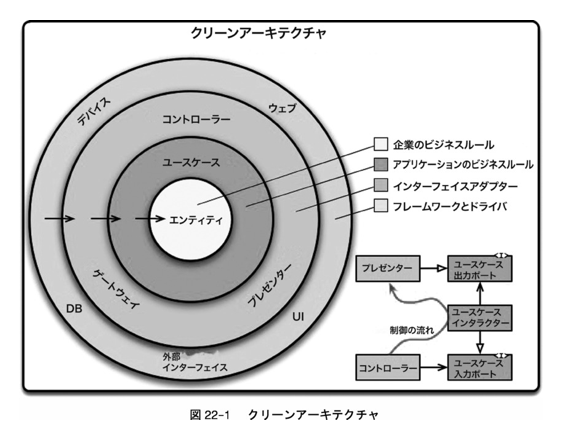
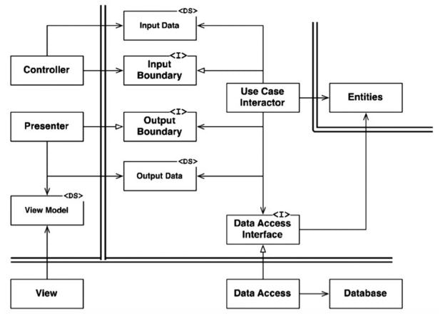
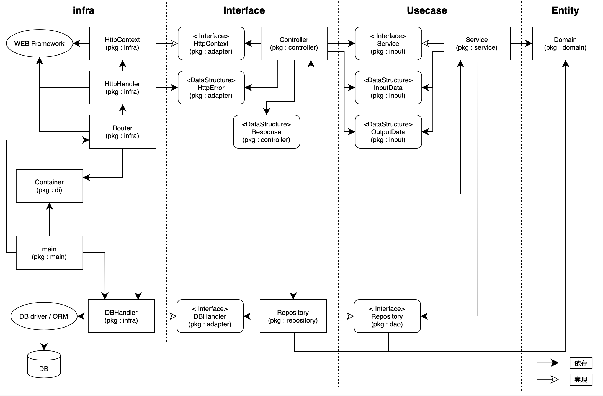
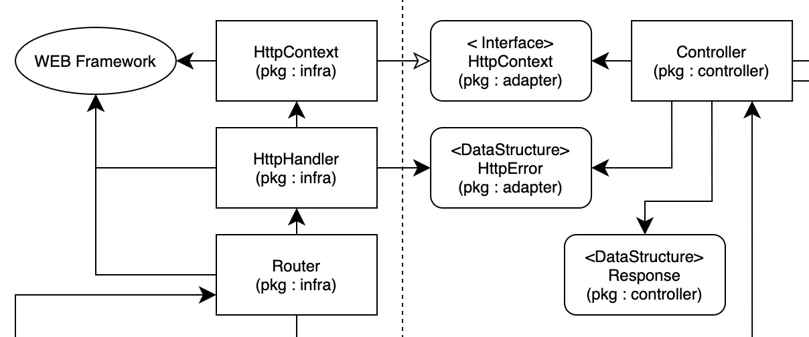
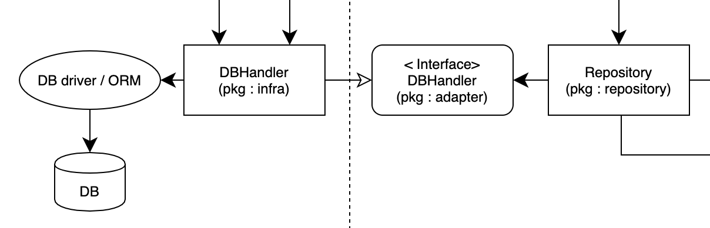
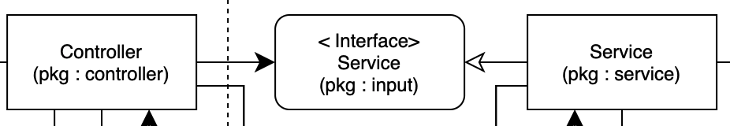

# Go + CleanArchitectureでのREST API設計

## 概要
CleanArchitectureに基づいて設計されたGoによるREST API

### CleanArchitectureとは

[【書籍】Clean Architecture 達人に学ぶソフトウェアの構造と設計](https://tatsu-zine.com/books/clean-architecture)
で提唱されたソフトウェアアーキテクチャの実装例です。 \
以下の図のようにソースコードをいくつかの領域に分割し、依存性が内側（上位レベルの方針）にだけ向くように設計します。


> Clean Architecture 達人に学ぶソフトウェアの構造と設計（p.200）より抜粋

このアーキテクチャは以下の特性を有しています。

> ・フレームワーク非依存：アーキテクチャは，機能満載のソフトウェアのライブラリに依存していない．これにより，システムをフレームワークの制約で縛るのではなく，フレームワークをツールとして使用できる。　\
> ・テスト可能：ビジネスルールは，UI，データベース，ウェブサーバー，その他の外部要素がなくてもテストできる。 \
> ・UI非依存：UIは，システムのほかの部分を変更することなく，簡単に変更できる．たとえば，ビジネスルールを変更することなく，ウェブUIはコンソールUIに置き換えることができる。 \
> ・データベース非依存：OracleやSQL ServerをMongo，BigTable，CouchDBなどに置き換えることができる．ビジネスルールはデータベースに束縛されていない。 \
> ・外部エージェント非依存：ビジネスルールは外界のインターフェースについて何も知らない。
> 
> Clean Architecture 達人に学ぶソフトウェアの構造と設計（p.200）より抜粋

以下の図は、データベースを使ったウェブベースのJavaシステムをクリーンアーキテクチャで実装した典型的な例として紹介されていたものです。\
今回は、この図を参考に実装を行っています。


> Clean Architecture 達人に学ぶソフトウェアの構造と設計（p.204）より抜粋

## 詳細

### API仕様

- GET /rooms：Roomの全件取得
  - responseBody：
    ```json
    [
      {
        "id": 1,
        "name": "room_name1",
        "createdAt": "2021-02-13T18:38:51+09:00",
        "updatedAt": "2021-02-13T18:38:51+09:00"
      },
      {
        "id": 2,
        "name": "room_name2",
        "createdAt": "2021-02-13T18:38:51+09:00",
        "updatedAt": "2021-02-13T18:38:51+09:00"
      }
    ]
- POST /rooms：Roomの作成
  - requestBody：
    ```json
    {"name": "room_name"}
  - responseBody：
    ```json
    {
      "id": 1,
      "name": "room_name",
      "createdAt": "2021-02-13T18:38:51+09:00",
      "updatedAt": "2021-02-13T18:38:51+09:00"
    }

※アーキテクチャの構成を明確に示すためにAPI自体はシンプルな機能のみにしています。

### 開発環境
- API
  - Go v1.15.3
    - gorilla/mux v1.8.0（ルーティング）
    - gorm.io/driver/mysql v1.0.3（MySQLドライバ）
    - gorm.io/gorm v1.20.11（ORM） 
    - DATA-DOG/go-sqlmock v1.5.0（データベースのモック生成）
- ミドルウェア
  - MySQL v5.7（マイグレーション：sql-migrate）
- コンテナ
  - Docker
  - docker-compose

### ディレクトリ構成と各ファイルの役割
※テストコードなどアーキテクチャと直接関係ないファイルは省略しています
```
app
    ├── di
    │    └── container.go　・　・　・　「DIコンテナ（依存性の注入）」
    │ 
    ├── domain（エンティティ）
    │    └── room.go　・　・　・　「テーブル設計と一致させたデータ構造体」
    │ 
    ├── infra（フレームワーク/ドライバ）
    │    ├── db_handler.go　・　・　・　「DBへの接続、クエリ実行、ORMの呼び出し」
    │    ├── http_context.go　・　・　・　「リクエストボディのパース処理、レスポンスの生成」
    │    ├── http_handler.go　・　・　・　「Controllerのラッパー、HttpContextの初期化、エラーハンドリング」
    │    └── router.go　・　・　・　「ルーティング」
    │ 
    ├── interface（インターフェイスアダプター）
    │    ├── adapter　・　・　・　「infra ↔︎ interfaceの境界線」
    │    │    ├── db_handler.go　・　・　・　「DBHandlerのインターフェイス」
    │    │    ├── http_context.go　・　・　・　「HttpContextのインターフェイス」
    │    │    ├── http_handler.go　・　・　・　「HttpHandlerのインターフェイス」
    │    │    └── http_error.go　・　・　・　「HttpHandlerへエラー内容を伝える際のデータ型」
    │    ├── controller　・　・　・　「リクエストをBindしてServiceへ処理を依頼し、処理結果をもとにレスポンスを生成」
    │    │    └── room_controller.go
    │    └── repository　・　・　・　「永続層への操作を組み立てる」
    │         └── room_repository.go
    │ 
    ├── usecase（ユースケース）
    │    ├── input　・　・　・　「controller ↔︎ serviceの境界線」
    │    │    └── room_input.go　・　・　・　「Serviceのインターフェイス、Controllerとやり取りする際のデータ型」
    │    ├── service　・　・　・　「domainやrepositoryを適宜呼び出してユースケースを実現」
    │    │    └── room_controller.go
    │    └── dao　・　・　・　「repository ↔︎ serviceの境界線」
    │         └── room_dao.go　・　・　・　「Repositoryのインターフェイス」
    │ 
    └── main.go　・　・　・　「各コンポーネントの初期化、サーバー起動」
```

### コードの依存関係を表した図



実際に実装したコードの依存関係を簡易的に表した図です。 \
右側が円の内側に相当し、各レイヤーの境界を越える際は、依存性の向きが内側に向くようになっています。\
円の外側に向かう制御が必要な箇所（Usecase層からのDBアクセス）は、依存性の注入（DI）を使って対処しています。

なお、[Go Code Review Comments](https://github.com/golang/go/wiki/CodeReviewComments#interfaces) では構造体を利用する側のパッケージにインターフェースを定義することが推奨されています。\
但し、本実装では以下のインターフェイスに関しては、例外的に別パッケージに分けています。

- `Service`のインターフェイス（`定義場所：input`パッケージ）→パッケージ単位で依存性の向きが内側に向くようにしたかったため
- `DBHandler`と`HttpContext`インターフェイス（定義場所：`adapter`パッケージ）→ファイルの見通しを良くするため
- `Repository`のインターフェイス（定義場所：`dao`パッケージ）→ 一つのServiceから複数のRepositoryを呼び出すケースも想定されるため

インターフェイスの命名については、実装と一対一の関係（同じ役割）なので、実装と同じ名前にしています。

DIコンテナ（依存性の注入）については、Wireやdigなどのツールを試しましたが、現状の構成では学習コストや外部ツール依存のリスクを上回るメリットを感じられなかったので自作しています。

### 設計のポイント

本実装において、設計をどうするかで苦慮した箇所を3点ピックアップしています。
1. infra層の改修のみでWEBフレームワークやORMなどの置換が可能
2. 各層をインターフェイスで結ぶことでモックを利用した単体テストを容易化
3. レイヤー間のデータのやり取りに専用のデータ構造体を利用して責務を明確化

#### 1. infra層の改修のみでWEBフレームワークやORMなどの置換が可能

ルーティングで設定するハンドラ関数の定義は、以下のように利用するWEBフレームワーク・ライブラリによって異なります。

- net/http：`func(http.ResponseWriter, *http.Request)`
- Gin：`func(*gin.Context)`
- Echo：`func(echo.Context) error`

ハンドラ関数をこれらの定義に合わせて実装すると、もしWEBフレームワークを別のものに切り替えたい場合に、全てのハンドラ関数の修正が必要になります。 \
（WEBフレームワークのメソッドをハンドラ関数内で呼び出していて、そのメソッドのシグネチャがフレームワーク変更で変わる場合、その箇所の修正も必要）

そこで、本実装ではハンドラ関数（controller）をラップする`HttpHandler`を用意し、そこでフレームワークの差異を吸収することで、修正箇所を１箇所に集約しています。 \
WEBフレームワークのメソッド呼び出しに関しては、`HttpContext`のインターフェイスを介すことで、メソッド呼び出しの修正箇所も集約しています。 \
`HttpContext`は、ルーティング時にフレームワークから引数で渡される`http.ResponseWriter`や`*http.Request`などをラップして、controllerから隠蔽します。



本実装では`net/http`を利用しています。

```go
// app/infra/router.go
func NewRouter(c *di.Container) *Router {
	r := mux.NewRouter()

	r.HandleFunc("/", httpHandler(c.Room.Index).run).Methods("GET")
	r.HandleFunc("/rooms", httpHandler(c.Room.Index).run).Methods("GET")
	r.HandleFunc("/rooms", httpHandler(c.Room.Create).run).Methods("POST")

	return &Router{Engine: r}
}
```
`httpHandler`では他にも、controllerからの戻り値`HttpError`を用いたエラーハンドリングの共通化と、予期せぬpanicからの復旧も担っています。 \
このあたりは、フレームワークに備わっているミドルウェアを利用した方が良いかもしれないと考えています。（実装が容易、責務の分割）

```go
// app/infra/http_handler.go
type httpHandler func(adapter.HttpContext) *adapter.HttpError

func (fn httpHandler) run(w http.ResponseWriter, r *http.Request) {
	context := NewHttpContext(w, r)
	defer func() {
		if err := recover(); err != nil {
			log.Println(err)
			http.Error(w, "Internal Server Error", http.StatusInternalServerError)
		}
	}()

	if err := fn(context); err != nil {
		http.Error(w, err.Error(), err.Code)
	}
}
```
以下は、各フレームワークのメソッド（リクエストのBind等）を呼び出す際の`HttpContext`のインターフェイスと実装部分です。

```go
// app/interface/adapter/http_context.go
package adapter

type HttpContext interface {
    Bind(i interface{}) error
    JSON(code int, i interface{}) error
}
```
```go
// app/infra/http_context.go
func NewHttpContext(w http.ResponseWriter, r *http.Request) adapter.HttpContext {
  return &httpContext{
    Writer:  w,
    Request: r,
  }
}

func (c *httpContext) Bind(i interface{}) (err error) {
    err = json.NewDecoder(c.Request.Body).Decode(i)
    if err != nil {
      return errors.New("invalid request")
    }
    return err
}

func (c *httpContext) JSON(code int, i interface{}) (err error) {
    res, err := json.Marshal(i)
    if err != nil {
        return errors.New("internal server error")
    }

    c.Writer.Header().Set("Content-Type", "application/json")
    c.Writer.WriteHeader(code)
    c.Writer.Write(res)
    return err
}
```

ORMについても、interface層から利用する際は`DBHandler`を経由することで、依存関係の逆転と修正箇所を集約しています。



これら実装のメリットは、interface層以下がフレームワークについて何も知らなくて良い様にすることで、infra層に修正箇所を集約できることです。

デメリットは、インターフェイスを含めてファイル数が多くなり、管理が煩雑になることが懸念されます。 \
また、フレームワークの機能を呼び出す為に、わざわざインターフェイスの実装を用意するのも冗長なように感じます。

今回はクリーンアーキテクチャの原則に則ることを重視して、infraとinterfaceの依存関係逆転が達成できる本実装を採用しましたが、interfaceが直接フレームワークを使う構成でも良いかもしれません。 \
（ビジネスロジックであるUsecase層に、WEBの都合が侵食しなければ良いという方針）

なお、フルスタックなフレームワーク（Beegoなど）やコード生成フレームワーク（goaなど）などは、今回の実装では置換出来ません。

#### 2. 各層をインターフェイスで結ぶことでモックを利用した単体テストを容易化

インターフェイスを用いることでgomockなどの外部ツールに頼らなくても、実装をモックに置き換えることができます。\
controllerの単体テストを例に説明します。



テスト対象のメソッドは、Roomを全件取得するためのハンドラ関数`Index`です。 \
今回は、内部で呼び出している`Service.All()`をモックに置き換えます。

```go
// app/interface/controller/room_controller.go
type RoomController struct {
	Service input.RoomService
}

func (c *RoomController) Index(hc adapter.HttpContext) *adapter.HttpError {
	rooms, err := c.Service.All()
	if err != nil {
		return adapter.NewHttpError(err.Error(), http.StatusBadRequest)
	}

	respBody := convertRoomsResponse(&rooms)
	if err := hc.JSON(http.StatusCreated, respBody); err != nil {
		return adapter.NewHttpError(err.Error(), http.StatusInternalServerError)
	}
	return nil
}
```

controllerでは、`input`パッケージ内で定義されている`Service`のインターフェイスを利用しています。

```go
// app/usecase/input/room_input.go
package input

type RoomService interface {
	All() (outData RoomsOutputData, err error)
	Create(inData RoomInputData) (outData RoomOutputData, err error)
}
```

`Service`の実装は、`service`パッケージ内で定義されています。 \
ここで定義されたコンストラクタはDI（依存性の注入）の際に呼び出されて、controllerに渡されます。\
コンストラクタは「Accept interfaces, Return structs」という広く浸透しているGoのInterfaceのお作法に従って、引数はインターフェイスで受け取って具象型（ポインタ）を返しています。

```go
// app/usecase/service/room_service.go
type RoomService struct {
	Repository dao.RoomRepository
}

func NewRoomService(repo dao.RoomRepository) *RoomService {
	return &RoomService{Repository: repo}
}

func (s *RoomService) All() (outData input.RoomsOutputData, err error) {
	rooms, err := s.Repository.All()
	if err != nil {
		return
	}
	
	outData = convertToRoomsOutputData(&rooms)
	return
}
```

```go
// app/usecase/dao/room_dao.go
package dao

type RoomRepository interface {
	All() (rooms domain.Rooms, err error)
	Create(room *domain.Room) (err error)
}
```

Serviceのモック`fakeRoomService`には、`input.RoomService`（インターフェイス）を埋め込んでいます。 \
これにより、まだテストコードを実装していないメソッドをわざわざ定義しなくても、`fakeRoomService`はインターフェイスを満たすことが出来る。 \
（例えば、RoomServiceには`Create`メソッドも定義されていますが、`Create`メソッドを`fakeRoomService`に定義しなくてもインターフェイスを満たせる）

モックするメソッド`All()`を定義し直して、実装内部で同じシグネチャのモック用のメソッド`fakeAll()`を返します。\
`fakeAll()`は、構造体で定義された関数で、構造体を初期化する際に関数の振る舞いを変更することで、モックの挙動を制御します。

```go
// app/interface/controller/room_controller_test.go
type fakeRoomService struct {
	input.RoomService
	fakeAll    func() (outData input.RoomsOutputData, err error)
}

func (i fakeRoomService) All() (outData input.RoomsOutputData, err error) {
	return i.fakeAll()
}
```

実際のテストコードではテーブル駆動テストで指定した戻り値でテストケースごとにモック生成しています。\
これにより、様々なテストケースに対応できるようにしています。

```go

func TestRoomControllerIndex(t *testing.T) {
	testCases := []struct {
		name          string
		serviceReturn input.RoomsOutputData
		serviceErr    error
		jsonErr       error
		expected      *adapter.HttpError
	}{
		{
			name:          "normal",
			serviceReturn: roomsOutputData,
			serviceErr:    nil,
			jsonErr:       nil,
			expected:      nil,
		},
		{
			name:          "serviceError",
			serviceReturn: input.RoomsOutputData{},
			serviceErr:    errors.New("serviceError"),
			jsonErr:       nil,
			expected:      adapter.NewHttpError("serviceError", 400),
		},
		{
			name:          "jsonError",
			serviceReturn: roomsOutputData,
			serviceErr:    nil,
			jsonErr:       errors.New("jsonError"),
			expected:      adapter.NewHttpError("jsonError", 500),
		},
	}

	for _, tc := range testCases {
		tc := tc
		t.Run(tc.name, func(t *testing.T) {
			t.Parallel()
			context := mocks.FakeHttpContext{
				FakeJSON: func(int, interface{}) error { return tc.jsonErr },
			}

			service := fakeRoomService{
				fakeAll: func() (outData input.RoomsOutputData, err error) {
					return tc.serviceReturn, tc.serviceErr
				},
			}
			controller := NewRoomController(service)

			if err := controller.Index(context); !reflect.DeepEqual(tc.expected, err) {
				t.Errorf("%v: controller.Index expected = %v, got = %v", tc.name, tc.expected, err)
			}
		})
	}
}
```

#### 3. レイヤー間のデータのやり取りに専用のデータ構造体を利用して責務を明確化

本実装では、リクエストボディを直接Domain(Entity層)にバインドせず、`input`パッケージのデータ構造体`InputData`にバインドしてServiceに渡しています。 \
更に、Service層からの戻り値は`input`パッケージのデータ構造体`OutputData`を指定し、レスポンスを生成する際も`controller`のデータ構造体`Response`に詰め替えています。

リクエストボディを直接Domain(Entity)にバインドして、全ての処理で使い回し、レスポンスもDomain(Entity)の構造体で返した方が構造体の変換処理が省けてシンプルになります。 \
但し、レイヤーを超えた構造体の引渡しを行えば、構造体の責務が曖昧になり、以下のような問題の発生が懸念されます。

- どのレイヤーにレスポンスのフォーマットとなるデータ構造体が定義されているか判断しづらい
- レスポンスのフォーマットを変更するのに、Entity層の修正が必要になる \
    （Entity層がレスポンスの形式を知っている）
- Entityのデータをそのまま返すので、意図せぬ情報漏えいが発生するリスクがある \
    （例えば、User構造体に外部に漏れてはいけないユーザーのIPアドレスが含まれており、その構造体でレスポンスを生成したことでIPアドレスが漏えいした等）

その為、各レイヤーにはそれぞれの関心のある項目だけで定義した構造体を利用しています。

なお、Domain(Entity層)をテーブル設計と同じデータ構造にしているので、`Repository`だけ例外的にレイヤーを飛び越えてDomain(Entity層)のデータ構造体を利用しています。

### 全体的な所感

#### 単体テストの実装のしやすさ
実際に全てのコードの単体テストを実装してみましたが、モックを作りやすいことはメリットとして大きいと感じました。 \
モックを使えばテストのスコープを狭められて、テストが壊れにくく、TDDも実践しやすくなるので、しっかりテストを書いて開発を進める場合には有効な構成だと考えています。

一方で、単体テストを書かないのであれば、インターフェイスは冗長なように感じます。 \
（Usecase層からのDBアクセスなど円の外側に向かう制御は依存性注入で解消できているため）

#### Usecase層の肥大化が懸念
MVCではファットモデルが問題になるケースが多いですが、MVCのモデルに相当する部分がService(Usecase層)とRepository(interface層)に分かれるので、MVCよりはコード肥大化が緩和されるのではないかと感じます。\
但し複数テーブルにまたがる様な処理や複雑なデータ加工を必要とする処理が増えると、処理を組み立てるUsecase層の肥大化が問題なって来ると思われます。

Domain(Entity層)にビジネスロジックを置くことで緩和できるでしょうが、Usecase層に置くアプリケーション固有のロジックとどの様に線引きするかは判断が非常に難しく、結局Usecase層にロジックが集中してしまいそうな印象を受けます。 \
シンプルに永続層のデータを返すだけのAPIであれば、この心配は無さそうですが、そうなるとクリーンアーキテクチャをわざわざ採用する必要も無いと考えています。

#### DDDを採用する場合の構成見直し
`Repository`・`Service`・`Domain`といったDDDの構成要素と同じ名称を採用していますが、DDDを本格的に導入する場合は、大きな構成の見直しが必要になると考えています。 \
理由としては、現状Domain(Entity層)とテーブルが一対一の関係になっている点や、Usecase層が手続き型な処理でユースケースを実現している点などがあげられます。 \
（DDDに関しては「ドメイン駆動設計入門」を一読した程度の理解度なので、どの様にすることが最適なのか現状不明確です）

DDDもそうですがGoの言語仕様やお作法も含めて、まだまだ全体的に理解が浅いと実感します。\
ただ設計を見直す度に新しい気づきがあるので、今後もより良い設計を検討して行きたいです。

## 参考情報
- [【書籍】Clean Architecture 達人に学ぶソフトウェアの構造と設計](https://tatsu-zine.com/books/clean-architecture) 
- [世界一わかりやすいClean Architecture](https://www.nuits.jp/entry/easiest-clean-architecture-2019-09) 
- [実践クリーンアーキテクチャ](https://nrslib.com/clean-architecture/#outline__7) 
- [Goのサーバサイド実装におけるレイヤ設計とレイヤ内実装について考える](https://www.slideshare.net/pospome/go-80591000) 
- [マイクロサービスにクリーンアーキテクチャを採用する上で考えたこと](https://engineering.mercari.com/blog/entry/2019-12-19-100000/)
- [Go Code Review Comments](https://github.com/golang/go/wiki/CodeReviewComments#interfaces)

## 開発ドキュメント

### コマンドリファレンス

#### セットアップ
```
# リポジトリクローン
git clone git@github.com:ryoutaku/simple-chat.git
cd simple-chat

# envコピー
cp env.development .env

# コンテナ起動
docker-compose up -d --build

# 作業用コンテナへbashで入る（マイグレーション実行時など）
docker exec -i -t simple_chat_woker bash
```

#### マイグレーション
```
# マイグレーションファイル生成
bin/migrate.sh new create_rooms

# マイグレーション実行
bin/migrate.sh up [-limit=0] [-dryrun]

# ロールバック実行
bin/migrate.sh down [-limit=0] [-dryrun]

# マイグレーションの適用状況を確認
bin/migrate.sh status

# 直近のマイグレーションを再適用
bin/migrate.sh redo
```
※sql-migrateを利用　https://github.com/rubenv/sql-migrate

#### APIリクエスト
```
# Roomの全件取得
curl -H "Content-Type: application/json" localhost:5050/rooms

# Roomの作成
curl -X POST -H "Content-Type: application/json" -d '{"name":"テストルーム"}' localhost:5050/rooms
```

### 公式ドキュメント
- [Golang](https://golang.org/doc/)
- [GORM](https://gorm.io/ja_JP/)
- [sql-migrate](https://github.com/rubenv/sql-migrate)
